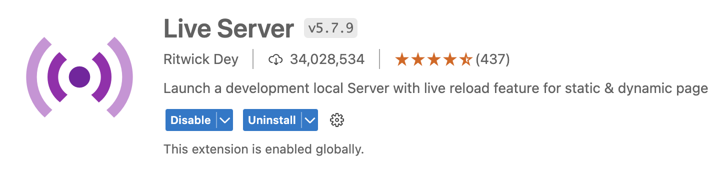

# Getting Started

1. Clone repo from `repo location`
2. In Visual Studio Code, install the `Live Server` extension by Ritwick Dey. This allows you to launch a lightweight local development server with live reload features.
   
3. In the workshop folder, right click the `flexbox.html` and select `Open with Live Server`. A new browser tab will open with the page contents.
4. Share your favorite animal in the meeting chat. We'll get started soon!
